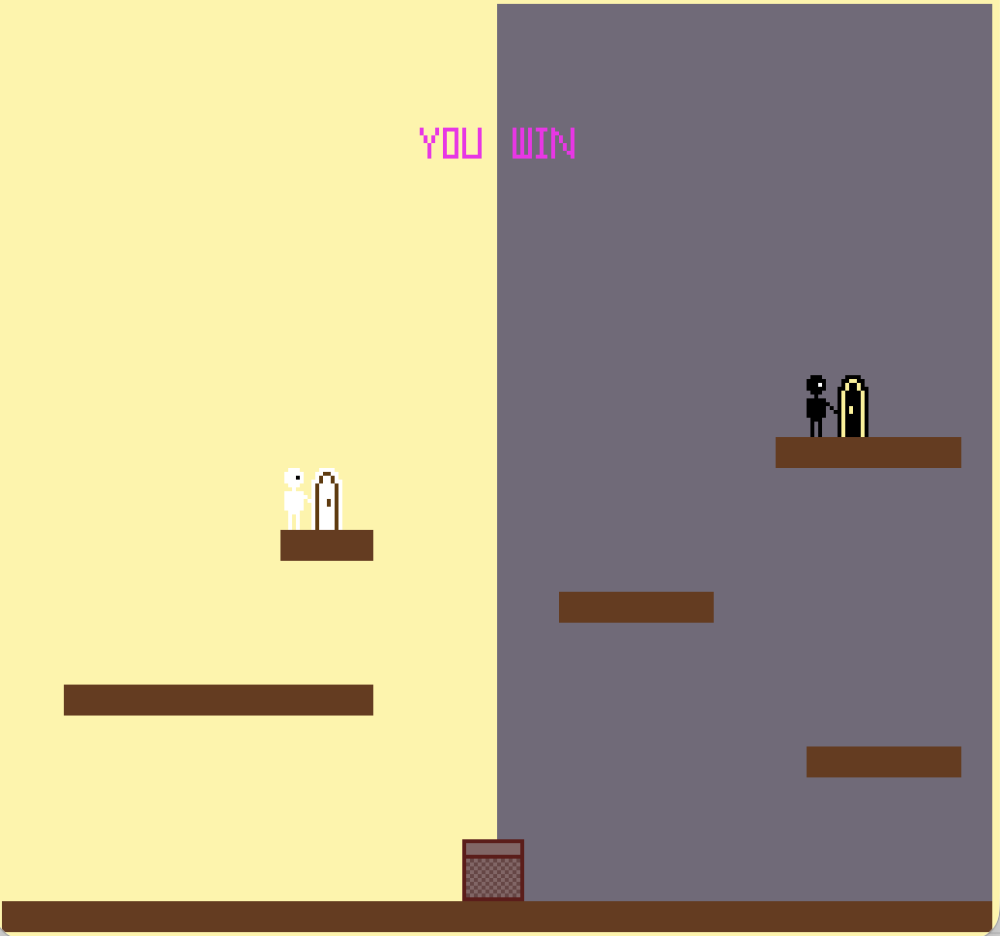

# Day and Night Jump

Author: Shuning Liu

Design: two players are controlled simultaneously, and have separate zones.

Screen Shot:

How Your Asset Pipeline Works:

PNGs in `assets/` are copied to `dist/`, then `extract_8_8` / `extract_8_16` / `extract_16_8` / `extract_16_16` convert them into PPU466 tiles and palettes. The day/night background and platforms are solid tiles written into `ppu.background`.

Source drawings: [player1](assets/player1.png), [player2](assets/player2.png), [box](assets/box.png), [coin](assets/coin.png), [door1](assets/door1.png), [door2](assets/door2.png), [you](assets/you.png), [win](assets/win.png), [die](assets/die.png).

How To Play:

Use left and right to move, space to jump, Esc for restart.
Try to let both players get into their own exits, remember they can't enter other's half screen.

This game was built with [NEST](NEST.md).
